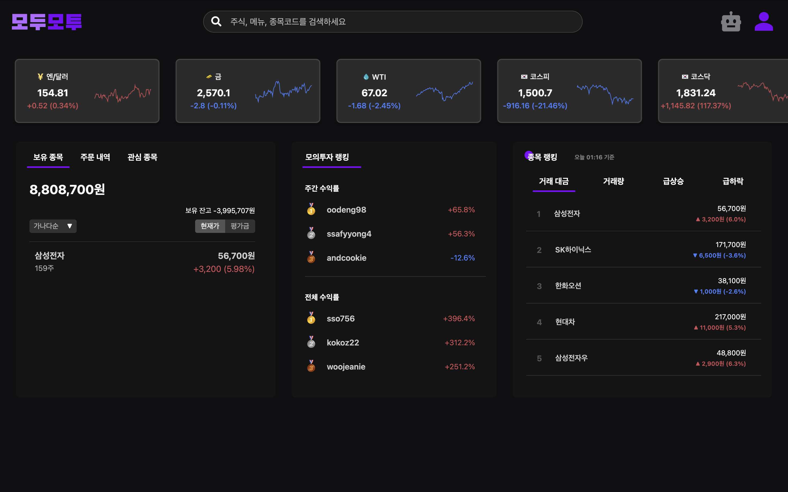
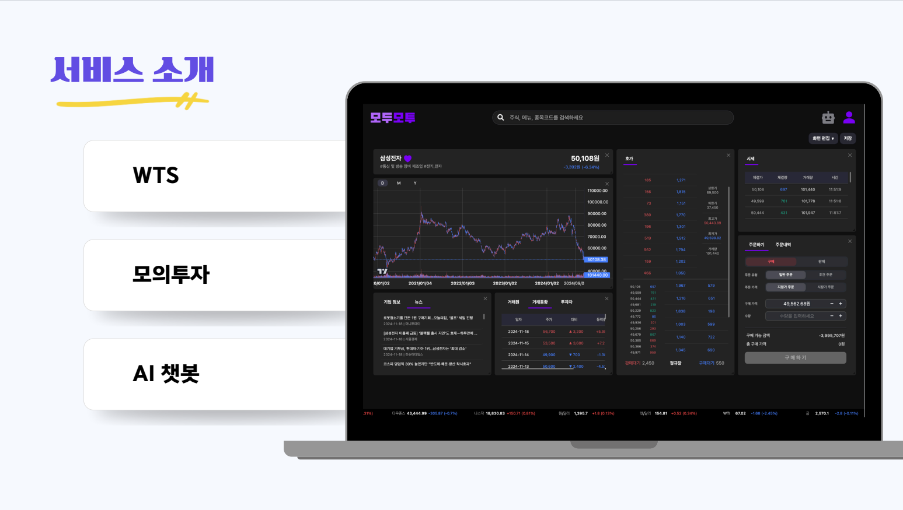
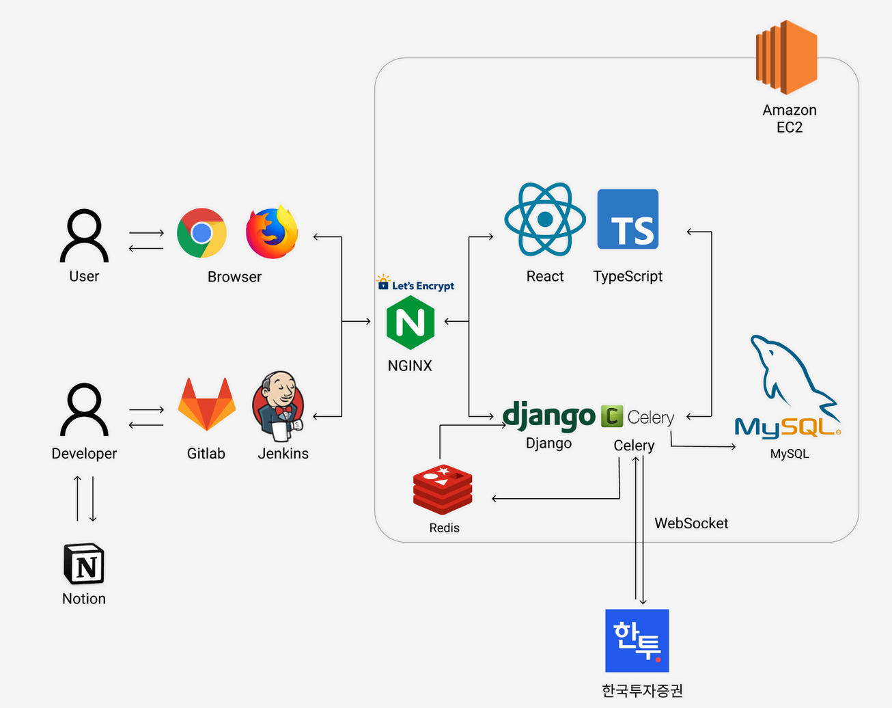
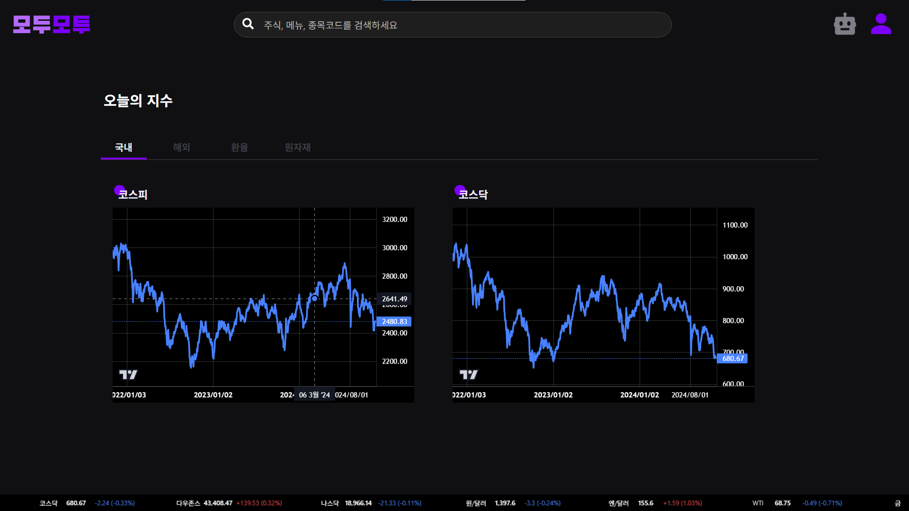
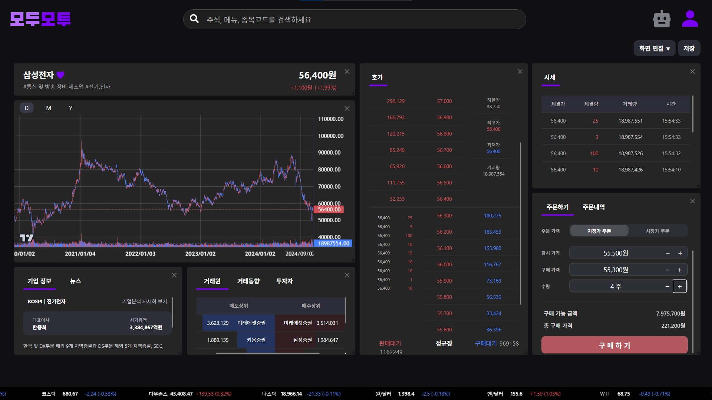
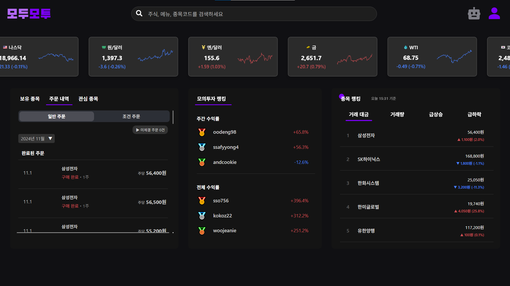
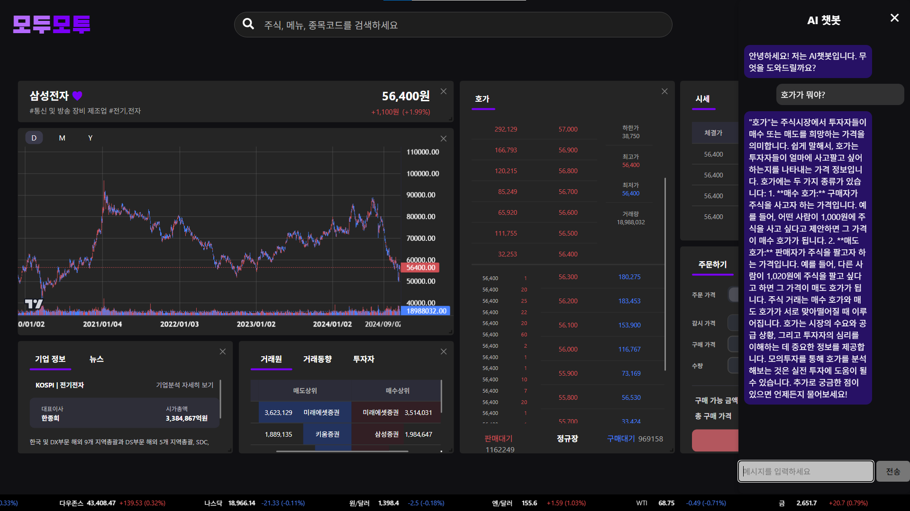

# 모두모투

모두가 사용하기 쉬운 WTS 모의투자 서비스 **모두모투!**

### [UCC 링크](https://youtu.be/-IW3y00URdY)

## 모두모투 소개

모두모투는 전문 투자자부터 초보 투자자까지 모두가 사용하기 쉬운 WTS 모의투자 플랫폼입니다.

## 시스템 아키텍처

## 주요 기능
### 거시경제 지표

거시경제 지표를 국내/해외/환율/원자재 순으로 확인할 수 있습니다.

### 대시보드

자유롭게 커스터마이징 가능한 대시보드를 통해, 사용자는 자유롭게 투자 화면을 편의에 맞게 구성할 수 있습니다.

### 모의투자

한국투자증권 API를 활용하여, 실제 주식 시장에서 모의투자를 진행할 수 있습니다. 일반 주문과 조건 주문, 지정가 주문과 시장가 주문을 설정하여 원하는 수량에 맞추어 매수 및 매도를 할 수 있습니다.

이는 주문 내역에서 확인할 수 있습니다.

### AI 챗봇

궁금한 증권 용어는 AI 챗봇을 활용하여 쉽게 알 수 있습니다.

## 멤버 소개
|제목|내용|내용|
|-----|-----|-----|
|팀장|정태완|BE, INFRA|
|팀원|이선재|FE|
|팀원|이찬규|FE|
|팀원|임광영|FE|
|팀원|최병주|FE|
